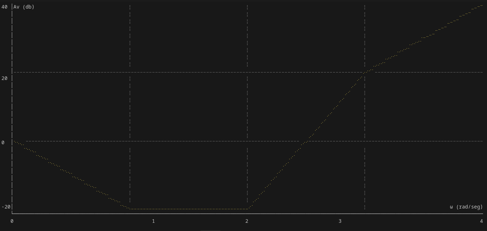

# Bode Grapher

Bode Grahper is a command-line tool written in Rust for plotting Bode diagrams of linear systems.  

## How to use

Currently, to run the project from the main folder, use:

```bash
cargo run <zeros separated by spaces> / <poles separated by spaces>
```
## Example

```bash
cargo run 10 100 100 / 1 1000
```



press any key to exit
